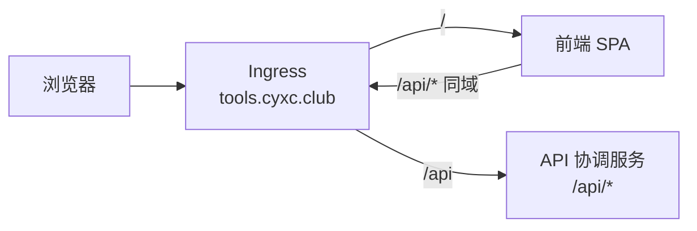

# tools.cyxc.club

cyxc 在线工具集：统一前端 + 单一 API 协调服务，部署于 Kubernetes。

- 站点：`https://tools.cyxc.club`
- API：`https://tools.cyxc.club/api/...`（统一协调入口）

## 架构



所有工具 API 由 `services/api` 统一对外协调；各工具以模块形式注册在 `app/tools/` 下，而非独立部署。

## 目录结构

```
tools.cyxc.club/
├── web/                    # 统一前端
├── services/
│   ├── api/                # API 协调服务（唯一后端入口）
│   └── common/             # 共享 FastAPI 库
├── deploy/helm/
└── docker-compose.yml
```

## 本地开发

```bash
cd web && npm install && cd ..
pip install -r services/api/requirements-dev.txt
npm run dev
```

访问 http://localhost:5173 ，API 文档 http://localhost:8080/api/docs

## 添加新工具

按 **[docs/CONVENTIONS.md](docs/CONVENTIONS.md)** 执行（含完整清单、命名、前后端模板）。

## Kubernetes 部署

```bash
docker build -t ghcr.io/cyxc1124/tools-web:0.1.0 ./web
docker build -f api/Dockerfile -t ghcr.io/cyxc1124/tools-api:0.1.0 ./services

helm upgrade --install tools ./deploy/helm \
  -n tools --create-namespace
```

### Ingress 路由（仅 HTTP，TLS 在集群外终止）

| 路径 | Service |
|------|---------|
| `/api` | tools-api |
| `/` | tools-web |

```bash
helm upgrade --install tools ./deploy/helm \
  -n tools --create-namespace
```

## 技术栈

- 前端：React 19、Vite 8、Tailwind CSS 4、TypeScript
- 后端：FastAPI（统一协调服务）
- 部署：Helm、Ingress

## License

AGPL-3.0 — 见 [LICENSE](LICENSE)。
