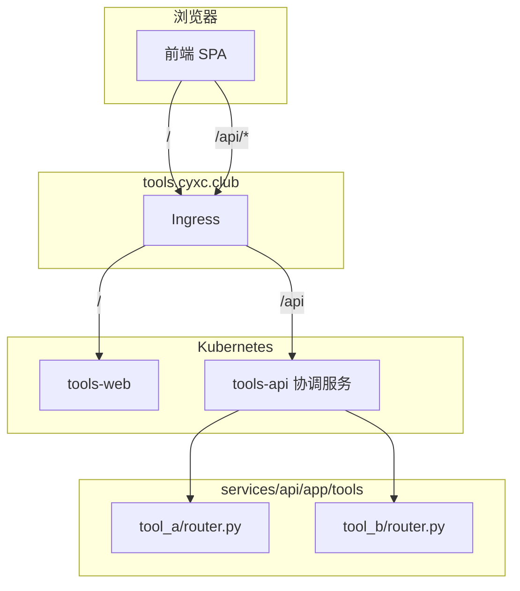

# 骨架与约定

本文档是 tools.cyxc.club 的**权威规范**。新增或修改工具时，按此执行。

---

## 1. 总体原则

| 原则 | 说明 |
|------|------|
| **同域** | 前端与 API 共用 `tools.cyxc.club`，浏览器用相对路径 `/api/...` 访问 |
| **单一 API 入口** | 只有一个对外后端：`services/api`，各工具是其内部模块 |
| **工具 ID 一致** | 前后端、URL 路径使用同一个 `tool_id`（kebab-case，如 `json-format`） |
| **API 版本化** | 业务接口挂在 `/api/{tool_id}/v1/` 下 |
| **注册表驱动** | 前后端各有一份 registry，新增工具必须双向注册 |

---

## 2. 架构



**请求路径示例**

| 用途 | 路径 |
|------|------|
| 前端首页 | `GET /` |
| K8s 探活 | `GET /health` |
| 协调层健康 | `GET /api/v1/health` |
| 工具 API | `GET /api/{tool_id}/v1/...` |
| OpenAPI | `GET /api/docs` |

---

## 3. 仓库目录

```
tools.cyxc.club/
├── web/                              # 统一前端
│   └── src/
│       ├── tools/registry.ts         # 【必改】前端工具注册表（含 Page 组件）
│       ├── pages/                    # 各工具页面
│       ├── api/client.ts             # 通用 HTTP 客户端
│       ├── App.tsx                   # 自动从 registry 注册路由，一般不改
│       └── layouts/MainLayout.tsx    # 公共布局（导航栏）
│
├── services/
│   ├── common/tools_common/          # 共享 FastAPI 库（一般不改）
│   └── api/                          # API 协调服务
│       └── app/
│           ├── main.py               # 应用入口
│           ├── core/                 # 配置、lifespan
│           ├── api/v1/               # 协调层路由（非工具业务）
│           ├── schemas/              # 协调层 Schema
│           └── tools/
│               ├── registry.py       # 【必改】后端工具注册表
│               └── {tool_id}/
│                   ├── router.py     # 【必建】工具 APIRouter
│                   └── schemas.py    # 可选：工具专用 Schema
│
├── deploy/helm/                      # K8s 部署（加工具通常不用改）
├── dev/backends.json                 # 本地 API 端口
├── scripts/dev.mjs                   # 本地一键启动
└── docs/CONVENTIONS.md               # 本文档
```

---

## 4. 命名约定

### tool_id

- 格式：**kebab-case**，小写英文与连字符，如 `markdown`、`json-format`
- 前后端、URL、目录名、注册表项**必须相同**
- 禁止使用 `example` 作为正式工具 ID（保留给演示）

### 路径

| 类型 | 格式 | 示例 |
|------|------|------|
| 前端页面 | `/{tool_id}` | `/markdown` |
| API 前缀 | `/api/{tool_id}` | `/api/markdown`（前端用 `apiPrefixFor(id)` 推导） |
| 业务端点 | `/api/{tool_id}/v1/{action}` | `/api/markdown/v1/convert` |

### 文件

| 位置 | 命名 |
|------|------|
| 后端工具目录 | `services/api/app/tools/{tool_id}/` |
| 后端路由 | `router.py`（导出 `router: APIRouter`） |
| 前端页面 | `web/src/pages/{ToolName}.tsx`（PascalCase 组件名） |
| 前端 API 类型 | `web/src/pages/{tool_id}/types.ts` 或页面内定义 |

---

## 5. 新增工具清单

以 `markdown` 为例，按顺序完成。

### 5.1 后端

- [ ] **1.** 创建目录 `services/api/app/tools/markdown/`
- [ ] **2.** 创建 `router.py`（导出 `router: APIRouter`）
- [ ] **3.** 有请求/响应体时创建 `schemas.py`（Pydantic 模型）
- [ ] **4.** 在 `services/api/app/tools/registry.py` 注册 `ToolRouter(id="markdown", ...)`
- [ ] **5.** 新增 Python 依赖时更新 `services/api/requirements.txt`
- [ ] **6.** 编写 `services/api/tests/test_markdown.py`
- [ ] **7.** 运行 `cd services/api && pytest`

### 5.2 前端

- [ ] **8.** 创建页面 `web/src/pages/MarkdownTool.tsx`（使用 `ToolPage` 布局）
- [ ] **9.** 在 `web/src/tools/registry.ts` 注册（含 `Page` 组件；`apiPrefix` 用 `apiPrefixFor(id)` 推导）
- [ ] **10.** 复杂 UI 拆到 `web/src/pages/markdown/` 或 `web/src/components/markdown/`
- [ ] **11.** 新增 npm 依赖时在 `web/` 下 `npm install <pkg>`
- [ ] **12.** 本地 `npm run dev` 验证

> **注意**：导航栏与首页卡片从 `registry.ts` 自动生成；路由由 `tool.Page` 绑定，**无需再改 `App.tsx`**。

### 5.3 部署

- [ ] **13.** `pytest` 通过
- [ ] **14.** 浏览器验证工具页与 API
- [ ] **15.** 确认 `/api/docs` 中出现新工具 tag
- [ ] **16.** 确认 `GET /api/v1/health` 的 `tools` 列表含新 `tool_id`
- [ ] **17.** 构建并推送镜像，Helm 升级（无需为每个工具改 Chart）

```bash
docker build -t ghcr.io/cyxc1124/tools-web:TAG ./web
docker build -f api/Dockerfile -t ghcr.io/cyxc1124/tools-api:TAG ./services
helm upgrade --install tools ./deploy/helm -n tools
```

### 5.4 通常无需修改的文件

| 文件 | 原因 |
|------|------|
| `web/src/App.tsx` | 从 registry 自动注册路由 |
| `web/vite.config.ts` | 已统一代理 `/api` |
| `dev/backends.json` | 只有 API 协调服务一个端口 |
| `deploy/helm/values.yaml` | Ingress 已固定 `/api` → api Service |
| `services/api/app/main.py` | 工具仅通过 registry 挂载 |

---

## 5.5 易漏项（对照检查）

| 易漏项 | 后果 | 如何避免 |
|--------|------|----------|
| 只改前端 registry 未改后端 registry | 404 / OpenAPI 无该工具 | 前后端 registry 成对提交 |
| `tool_id` 前后端不一致 | 请求打到错误路径 | 统一 kebab-case，用同一字符串 |
| 前端 API 路径漏写 `/v1` | 404 | 调用 `client.get('/v1/...')` |
| 未加 Python/npm 依赖 | 运行时 ImportError / 构建失败 | 改 requirements.txt / package.json |
| 未写测试 | 回归难发现 | 至少覆盖一个主流程端点 |
| 协调层健康未验证 | 监控不知道新工具已注册 | 断言 `/api/v1/health` 含新 id |
| 在 registry 漏填 `Page` | 首页有入口但路由不存在 | TypeScript 会要求 `Page` 字段 |

---

## 5.6 注册关系一览

```
web/src/tools/registry.ts          services/api/app/tools/registry.py
        │                                      │
        │  id、path、Page、展示信息               │  ToolRouter(id, router)
        ▼                                      ▼
   App / 导航 / 首页                        create_api_app 挂载
        │                                      │
        └────────── /api/{id}/v1/* ────────────┘
                    tool_id 必须相同
```

## 6. 后端规范（FastAPI）

### 6.1 工具 router 模板

```python
# services/api/app/tools/markdown/router.py
from fastapi import APIRouter

from app.tools.markdown.schemas import ConvertRequest, ConvertResponse

router = APIRouter()


@router.post(
    "/convert",
    response_model=ConvertResponse,
    summary="Markdown 转换",
)
async def convert(body: ConvertRequest) -> ConvertResponse:
    ...
```

挂载后完整路径为：`POST /api/markdown/v1/convert`

### 6.2 注册

```python
# services/api/app/tools/registry.py
from app.tools.markdown.router import router as markdown_router

def get_tool_routers() -> list[ToolRouter]:
    return [
        ToolRouter(id="markdown", router=markdown_router),
        # ...
    ]
```

### 6.3 必须遵守

| 规则 | 说明 |
|------|------|
| 使用 `APIRouter` | 不要在 `router.py` 里创建 `FastAPI()` 实例 |
| 声明 `response_model` | 所有端点使用 Pydantic Schema |
| 路由路径不带前缀 | 前缀由 `create_api_app` 自动加 `/api/{id}/v1` |
| 工具内 `/health` 可选 | K8s 探活用协调层 `/health`；工具可提供 `/health` 供前端自检 |
| 依赖注入 | 配置用 `SettingsDep`；复杂依赖放 `app/tools/{id}/deps.py` |
| Schema 分离 | 请求/响应模型放 `schemas.py`，不要堆在 router 里 |
| 不修改 `main.py` | 新工具只改 `tools/registry.py` |
| 新 Python 依赖 | 写入 `services/api/requirements.txt` |

### 6.4 目录演进（工具变复杂时）

```
app/tools/markdown/
├── router.py       # 路由聚合，include 子 router
├── schemas.py
├── deps.py         # Depends
├── service.py      # 业务逻辑（纯 Python，便于测试）
└── endpoints/
    ├── convert.py
    └── preview.py
```

### 6.5 测试

```python
# services/api/tests/test_markdown.py
import pytest
from httpx import AsyncClient


@pytest.mark.asyncio
async def test_convert(client: AsyncClient) -> None:
    response = await client.post(
        "/api/markdown/v1/convert",
        json={"text": "# hi"},
    )
    assert response.status_code == 200
```

---

## 7. 前端规范（React）

### 7.1 注册工具

```typescript
// web/src/tools/registry.ts
import { MarkdownToolPage } from '@/pages/MarkdownTool'

{
  id: 'markdown',
  name: 'Markdown',
  description: '...',
  path: '/markdown',
  Page: MarkdownToolPage,
  tags: ['text'],
}
```

API 前缀统一用 `apiPrefixFor('markdown')` → `/api/markdown`，不要手写不一致的路径。

### 7.2 API 调用

```typescript
import { createToolClient } from '@/api/client'
import { apiPrefixFor } from '@/tools/api-prefix'

const client = createToolClient(apiPrefixFor('markdown'))

// 实际请求：POST /api/markdown/v1/convert
await client.post('/v1/convert', { text: '...' })
```

页面模块**不要**在顶层从 `registry.ts` 导入（会与 registry 循环依赖导致白屏）。`apiPrefixFor` 使用 `@/tools/api-prefix`。

**注意**：`apiPrefixFor(id)` 得到 `/api/{id}`，业务路径从 `/v1/` 开始。

### 7.3 页面结构

- 使用 `ToolPage` 布局组件（`@/layouts/MainLayout`）
- 页面文件放 `web/src/pages/`
- 工具专属组件放 `web/src/pages/{tool_id}/` 或 `web/src/components/{tool_id}/`
- 不在页面里硬编码 `https://tools.cyxc.club`；`VITE_API_BASE` 生产环境留空

### 7.4 路由

路由由 `registry.ts` 中的 `Page` + `path` 自动注册到 `App.tsx`，**新增工具不必改 `App.tsx`**。

---

## 8. 本地开发

```bash
# 一次性
cd web && npm install && cd ..
pip install -r services/api/requirements-dev.txt

# 日常
npm run dev          # 启动 API（8080）+ Vite（5173）
```

| 服务 | 地址 |
|------|------|
| 前端 | http://localhost:5173 |
| API 文档 | http://localhost:8080/api/docs |
| 协调层健康 | http://localhost:8080/api/v1/health |

Vite 将 `/api` 代理到 `dev/backends.json` 中的 `api` 端口（默认 8080）。

同域调试（可选）：

```bash
# /etc/hosts: 127.0.0.1 tools.cyxc.club
caddy run --config dev/Caddyfile   # http://tools.cyxc.club
```

---

## 9. 部署

### 镜像

```bash
docker build -t ghcr.io/cyxc1124/tools-web:TAG ./web
docker build -f api/Dockerfile -t ghcr.io/cyxc1124/tools-api:TAG ./services
```

### Ingress 路由（仅 HTTP）

HTTPS 不在 Ingress 层终止（由 CDN / 外层 LB 处理）。Chart 只配置 HTTP 路径分流：

| 路径 | Service |
|------|---------|
| `/api` | tools-api |
| `/` | tools-web |

```bash
helm upgrade --install tools ./deploy/helm -n tools
```

### 何时需要独立后端 Service

默认所有工具在 `services/api` 内。仅当满足以下**任一**条件时，才考虑拆成内部 Service + 协调层 HTTP 转发：

- 需要不同运行时（如 Node、Go、GPU）
- 资源隔离（CPU/内存限制差异大）
- 独立扩缩容

拆分时仍保持对外路径 `/api/{tool_id}/v1/*` 不变，由协调层代理。

---

## 10. 禁止事项

| 禁止 | 原因 |
|------|------|
| 在 `services/` 下为每个工具建独立部署目录 | 破坏单一协调入口约定 |
| 前端写死完整 API 域名 | 破坏同域与本地代理 |
| 跳过 registry 直接写路由 | 导航、首页、协调层健康无法感知新工具 |
| 只注册一端 registry | 前端或 API 一侧 404 |
| 业务 API 不带 `/v1` | 破坏版本化约定 |
| 在 `tools_common` 放工具业务逻辑 | 共享库只放基础设施代码 |

---

## 11. 参考实现

当前演示工具 `example` 可作为最小参考：

| 层 | 文件 |
|----|------|
| 后端路由 | `services/api/app/tools/example/router.py` |
| 后端注册 | `services/api/app/tools/registry.py` |
| 前端注册 | `web/src/tools/registry.ts` |
| 前端页面 | `web/src/pages/ExampleTool.tsx` |
| 测试 | `services/api/tests/test_health.py` |

---

## 13. 当前骨架尚未覆盖（按需扩展）

以下场景**不在**默认清单内，遇到时再按工具需求补充：

| 场景 | 现状 | 建议 |
|------|------|------|
| 文件上传 | `createToolClient` 仅 `get`/`post` JSON | 扩展 client 或工具页内直接用 `FormData` + `fetch` |
| 工具专属环境变量 | 仅全局 `API_*` | 在 `Settings` 子类或 `app/tools/{id}/config.py` 扩展，前缀 `{ID}_` |
| OpenAPI → TS 类型同步 | 手动维护类型 | 体量大时可引入 codegen；小工具继续手写 |
| 鉴权 / 限流 | 未实现 | 在协调层 middleware 或 Ingress 统一加 |
| 独立内部 Service | 未实现代理 | 见第 9 节，在协调层 HTTP 转发 |
| 前端国际化 | 未实现 | 工具页内中文即可，后续可加 i18n |
| CI 自动跑测试 | 未配置 | 建议在 PR 中跑 `pytest` + `npm run build` |

---

| 日期 | 说明 |
|------|------|
| 2026-06 | 初版：单一 API 协调服务 + 工具模块注册表 |
| 2026-06 | 补全易漏项；前端 registry 合并 Page，取消 App.tsx 双注册 |
